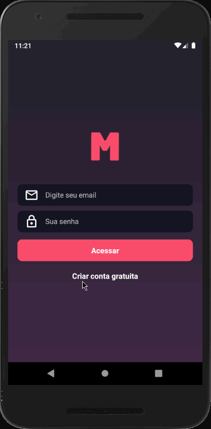

[](https://insomnia.rest/run/?label=MeetApp&uri=https%3A%2F%2Fraw.githubusercontent.com%2FMarceloHBoff%2Fmeetapp%2Fmaster%2Finsomnia.json)

<h2 align="center">
  
  <div align="center">MeetApp</div>
</h2>

<h4 align="center">
  A FullStack application to create meetups and publish to people subscribe.
</h4>

---

<p align="center">
  

  

  

  
</p>

<h2>📔 Description</h2>

This application was developed for bootcamp GoStack final challenge. In frontend the organizers can create meetups and mobile is for other users see all meetups and subscribe

by Rocketseat ❤️

---

`Web Application`

<details>
  <summary>See</summary>


</details>

`Mobile`

<details>
  <summary>See</summary>



</details>

<h2>🚀 Technologies</h2>

- [NodeJS](https://nodejs.org)
- [Express](https://expressjs.com/pt-br/)
- [Sequelize](https://sequelize.org/)
- [Docker](https://www.docker.com/)
- [Postgres](https://www.postgresql.org/)
- [Redis](https://redis.io/)
- [Nodemailer](https://nodemailer.com/about/)
- [ReactJS](https://reactjs.org/)
- [React Native](https://facebook.github.io/react-native/)
- [Axios](https://github.com/axios/axios)
- [Styled-Components](https://styled-components.com/)
- [Reactotron](https://infinite.red/reactotron)
- [React Navigation](https://reactnavigation.org/)
- [ESLint](https://eslint.org/)
- [Prettier](https://prettier.io/)

---

<h2>❓ How to use</h2>

For run backend is necessary instance of Postgres running on port 5432 and Redis instance on port 6379

`Backend`

```bash
# Clone this repository
$ git clone https://github.com/MarceloHBoff/meetapp/tree/master/backend

# Go into the repository
$ cd meetapp/backend

# Install dependencies for the backend
$ yarn

# Run the backend server
$ yarn dev
```

`Frontend`

```bash
# Clone this repository
$ git clone https://github.com/MarceloHBoff/meetapp/tree/master/frontend

# Go into the repository
$ cd meetapp/frontend

# Install dependencies for the frontend
$ yarn

# Run the frontend
$ yarn start
```

`Mobile`

```bash
# Clone this repository
$ git clone https://github.com/MarceloHBoff/meetapp/tree/master/mobile

# Go into the repository
$ cd meetapp/mobile

# Install dependencies for the mobile
$ yarn

# Start React Native Server in Android
$ react-native run-android

# Start React Native Server in IOS
$ react-native run-ios
```

Made with love by [Marcelo Boff!](https://www.linkedin.com/in/marcelo-boff)
